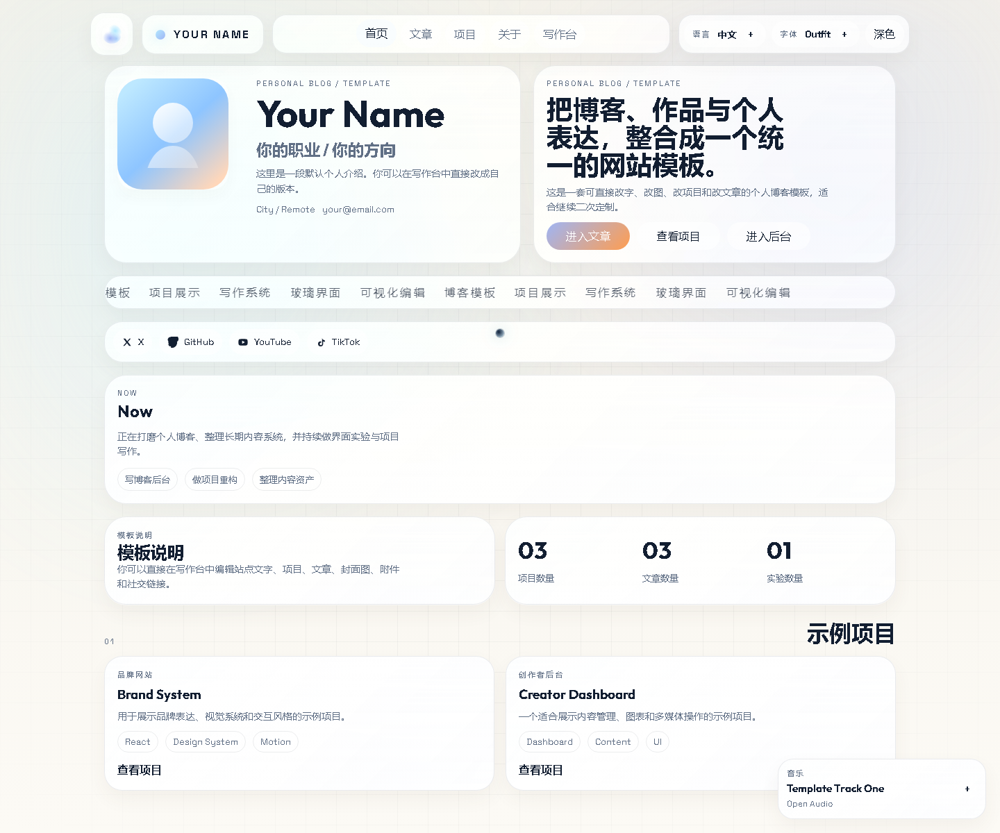

# Personal Blog Template

A visual-first personal blog template with a built-in editor, article and project management, multilingual UI, and a secure Node-backed studio.

一个以视觉表达为核心的个人博客模板，内置内容编辑后台、文章与项目管理、多语言界面，以及基于 Node 的安全开发者编辑台。



## Preview

- Repository: [HarrisonCN/personal-blog-template](https://github.com/HarrisonCN/personal-blog-template)
- GitHub Pages: [harrisoncn.github.io/personal-blog-template](https://harrisoncn.github.io/personal-blog-template/)

Important:
- GitHub Pages is a static preview only.
- Secure studio login and server-side persistence work only when the Node server is running.

注意：
- GitHub Pages 只提供静态前端预览。
- 安全登录、内容保存和开发者编辑能力只有在 Node 服务运行时才可用。

## Why This Template

This project is for people who want more than a plain markdown blog. It combines:

- a portfolio-style homepage
- article and project presentation
- multiple visual modes on the same content layer
- a built-in studio for editing content without touching code
- a server-backed auth flow for the editor

这不是一个单纯的 markdown 博客壳，而是把下面这些能力放进同一个站点：

- 个人主页展示
- 文章与项目内容呈现
- 同一份内容下的多主题视觉模式
- 无需改代码的内置编辑后台
- 基于服务端的开发者编辑登录流程

## Features

- Built-in studio for editing articles, projects, site copy, social links, custom cards, browser title, and background settings
- Server-side studio auth with cookie session support
- Article attachments with custom inline placement inside content
- Cover image upload for articles and home cards
- Music player with custom source input
- Language switching, font switching, theme switching, and palette control
- Multiple visual modes on the same content layer
- Guestbook support
- GitHub Pages workflow for static preview deployment

- 内置开发者编辑，可修改文章、项目、站点文案、社交链接、自定义卡片、标签页标题和背景设置
- 开发者编辑使用服务端鉴权与 Cookie 会话
- 支持图片、音频、视频和其他附件，并可插入正文指定位置
- 支持文章封面与首页卡片封面上传
- 支持自定义音源的音乐播放器
- 支持语言、字体、主题和调色盘切换
- 支持同一份内容切换不同视觉模式
- 自带留言板
- 自带 GitHub Pages 静态预览工作流

## Theme Modes

The template currently ships with these page modes:

- `Default`: the main liquid and atmospheric presentation
- `X Flow`: a cleaner editorial-style mode with a different layout language
- `Antigravity`: a more experimental visual mode

当前模板包含这些主题模式：

- `Default`：主站风格，偏液态与氛围感
- `X Flow`：更克制、更像编辑设计站点的样式
- `Antigravity`：更实验性的视觉模式

The content stays the same while the presentation changes.

文字内容保持一致，变化的是整页的视觉逻辑与排版方式。

## Tech Stack

- React 18
- Vite
- React Router
- Express
- GSAP
- Three.js
- Plain CSS

## Quick Start

### 1. Install

```bash
npm install
```

### 2. Front-end Only

```bash
npm run dev
```

Use this when you only want to preview the UI.

只看前端界面时用这个。

### 3. Full Local Stack

```bash
npm run dev:full
```

This starts:

- the Vite front end
- the Node server
- secure studio auth
- server-side content persistence

这个命令会同时启动：

- Vite 前端
- Node 服务
- 开发者编辑安全登录
- 服务端内容持久化

### 4. Production Build

```bash
npm run build
npm run start
```

## Environment Variables

See [.env.example](./.env.example).

```bash
STUDIO_USERNAME=ADMIN
STUDIO_PASSWORD=CHANGE_ME_123
# Optional: use a SHA-256 hex string instead of STUDIO_PASSWORD
# STUDIO_PASSWORD_HASH=
SESSION_SECRET=replace-with-a-long-random-secret
PORT=8787
```

Recommended:
- change the default credentials immediately
- use `STUDIO_PASSWORD_HASH` in real deployments
- use a strong `SESSION_SECRET`

建议：
- 立刻修改默认账号密码
- 正式部署时优先使用 `STUDIO_PASSWORD_HASH`
- 为 `SESSION_SECRET` 使用足够长的随机值

## Windows Scripts

After building, you can use:

```powershell
powershell -ExecutionPolicy Bypass -File .\start-blog.ps1
```

Stop it with:

```powershell
powershell -ExecutionPolicy Bypass -File .\stop-blog.ps1
```

## Deployment Notes

### GitHub Pages

This repository includes a GitHub Pages workflow:

- [`.github/workflows/pages.yml`](./.github/workflows/pages.yml)

When you push to `main`:

- the static site is built automatically
- GitHub Pages is updated automatically
- the Node backend is not deployed there

### Node Hosting

If you want the secure studio to work in production, deploy it to a Node-capable environment such as:

- Render
- Railway
- VPS + Nginx + PM2
- any other standard Node host

如果你希望正式环境里也能使用安全开发者编辑，请部署到支持 Node 的平台，而不是只放在 GitHub Pages 上。

## Project Structure

```text
.
├─ src/
│  ├─ App.jsx
│  ├─ styles.css
│  ├─ theme-presets.css
│  ├─ theme-scenes.css
│  ├─ data/siteContent.js
│  └─ components/
├─ server.js
├─ .env.example
├─ start-blog.ps1
├─ stop-blog.ps1
└─ .github/workflows/pages.yml
```

## Main Files You’ll Edit

- [src/data/siteContent.js](./src/data/siteContent.js): seed content, UI copy, presets, and defaults
- [src/App.jsx](./src/App.jsx): app structure, routes, editor logic, theme switching
- [src/styles.css](./src/styles.css): shared styling
- [src/theme-presets.css](./src/theme-presets.css): per-theme page styling
- [src/theme-scenes.css](./src/theme-scenes.css): theme scene visuals
- [server.js](./server.js): auth, persistence, API, and static hosting

## Data Storage

When the Node server runs, content is stored in:

- `server/data/store.json`

That file is ignored by Git and acts as runtime content storage.

Node 服务运行时，内容会写入：

- `server/data/store.json`

这个文件已被 Git 忽略，用作运行时存储。

## Security Boundary

This project is safer than a pure front-end password gate because the studio login is handled on the server. But it is still a template, not a hardened SaaS product.

Current protection includes:

- server-side credential verification
- session cookie auth
- basic security headers
- request origin checks
- lockout for repeated failed login attempts

这比“纯前端写死密码”的做法安全得多，但它仍然是模板，不是完整商用后台系统。

## Design Inspiration

This README structure was rewritten with the clarity patterns commonly seen in mature GitHub repositories such as:

- [microsoft/vscode](https://github.com/microsoft/vscode)
- [vercel/next.js](https://github.com/vercel/next.js)
- [facebook/react](https://github.com/facebook/react)

参考的是这些高星仓库在 README 中对“项目价值、快速开始、文档入口、边界说明”的组织方式，而不是照搬它们的内容。

## License

MIT
